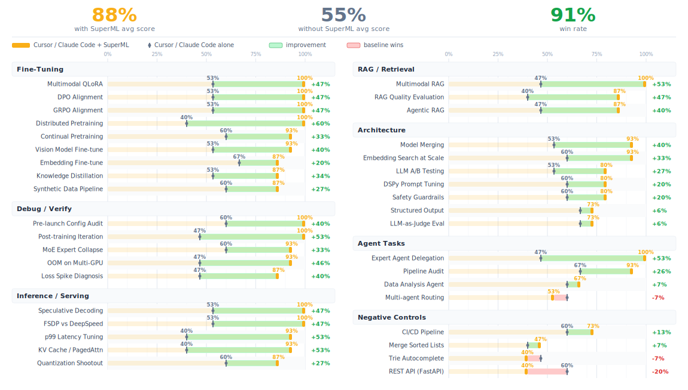

# SuperML

<p align="center">
  <strong>Give your AI coding agent ML engineering superpowers.</strong>
</p>

<p align="center">
  <a href="https://leeroopedia.com"></a>
  <a href="https://github.com/leeroo-ai/superml/blob/main/LICENSE"></a>
  <a href="https://discord.gg/hqVbPNNEZM"></a>
  <a href="https://github.com/leeroo-ai/superml"></a>
  <a href="https://www.ycombinator.com/companies/leeroo"></a>
</p>

<p align="center">
  <em>Watch how SuperML works in 90 seconds:</em>
</p>
<p align="center">
  <a href="https://www.youtube.com/watch?v=fWxAzfnLW3Q">
    
  </a>
</p>

<p align="center">If SuperML helps you, give it a ⭐ it helps others find the project.</p>

---

It adds two things your coding agent doesn't have:

**ML Pipeline**: Seven skills that encode the workflow you already follow. Plan against real framework docs. Catch config mistakes before they cost you GPU hours. Debug OOM, NaN, and divergence by root cause, not by guessing. Get ranked next steps when metrics plateau. An agentic experiment memory carries hypotheses, results, and lessons across sessions — your agent stops repeating failed experiments and starts compounding what works.

**Memory**: Backed by [Leeroopedia](https://leeroopedia.com), 27k+ pages across 1000+ ML/AI frameworks. Config references, debugging heuristics, implementation patterns, and battle-tested defaults from vLLM to DeepSpeed to LangChain. Built by the [Leeroo](https://leeroo.com) continuous learning system, structured as a browsable wiki, and continuously updated by AI and human engineers. When your agent recommends a config, it points to the page it learned it from.

Works with Claude Code, Cursor, Codex, OpenCode, and Gemini CLI.

## How It Works

1. **A session hook** loads automatically, zero setup per conversation.
2. **Skills** guide the ML workflow, verify before launch, debug by root cause, iterate on results, track what worked.
3. **MCP tools** connect to the Leeroopedia knowledge base, your agent looks things up and cites real docs instead of guessing.
4. **A persistent ML agent** (`ml-expert`) handles deeper tasks and remembers your hardware, experiments, and lessons across sessions.

## Results

37 ML tasks scored head-to-head: Cursor / Claude Code with SuperML vs without. Each response rated by independent LLM judges across correctness, specificity, mistake prevention, actionability, and grounding.

<p align="center">
  
</p>

See [TESTED_TASKS.md](TESTED_TASKS.md) for detailed scores and methodology.

## Prerequisites

### API Key (optional, highly recommended)

The plugin works without an API key — skills use web search to ground answers. With a key, your agent gets access to the Leeroopedia knowledge base (27k+ pages, faster and more precise lookups). The plugin will tell you if it's running without a key.

To get a key: [app.leeroopedia.com](https://app.leeroopedia.com/dashboard) — $20 free credit on signup, no credit card.

```bash
export LEEROOPEDIA_API_KEY=kpsk_your_key_here
```

Add to your shell profile (`~/.bashrc`, `~/.zshrc`) so it persists.

## Installation

### Claude Code

Register the marketplace, then install the plugin:

```
/plugin marketplace add leeroo-ai/leeroo-marketplace
/plugin install superml@leeroo-marketplace
```

Or install directly from GitHub:

```bash
claude plugin add --from-github leeroo-ai/superml
```

### Cursor

In Cursor Agent chat (waiting for Cursor team approval):

```
/add-plugin superml
```

Or clone into your project — Cursor auto-detects `.cursor-plugin/plugin.json`:

```bash
git clone https://github.com/leeroo-ai/superml.git
```

### Codex

See [.codex/INSTALL.md](.codex/INSTALL.md).

### OpenCode

See [.opencode/INSTALL.md](.opencode/INSTALL.md).

### Gemini CLI

```bash
git clone https://github.com/leeroo-ai/superml.git
gemini extension add ./superml/gemini-extension.json
```

### Alternative: Remote MCP (no local install)

If you just want the knowledge base without the full plugin, see [leeroopedia-mcp](https://github.com/Leeroo-AI/leeroopedia-mcp) for setup instructions.

You get the MCP tools (memory) but not the workflow skills (process).

### Verify Installation

Start a conversation and try something like:

```
I'm fine-tuning Llama 3.1 8B on 50k instruction pairs with 1xA100 80GB.
Set up the full training config — QLoRA, proper chat template, loss masking on prompts.
```

If it's working, your agent will ground its answer in documentation (KB citations or web sources), catch common pitfalls before they waste a training run, and give you a runnable config.

## What's Inside

### Skills

<!-- BEGIN_SKILLS_TABLE -->
| Skill | What it does |
|-------|-------------|
| [ml-plan](skills/ml-plan/SKILL.md) | Plan training runs, architectures, and multi-step pipelines |
| [ml-verify](skills/ml-verify/SKILL.md) | Check configs, code, and math before you burn GPU hours |
| [ml-debug](skills/ml-debug/SKILL.md) | Debug OOM, NaN, divergence, crashes, bad throughput |
| [ml-iterate](skills/ml-iterate/SKILL.md) | Ranked next steps when results aren't where you want them |
| [ml-experiment](skills/ml-experiment/SKILL.md) | Track experiments — hypotheses, results, and learnings across sessions |
| [ml-research](skills/ml-research/SKILL.md) | Deep-dive into ML topics, compare approaches, survey frameworks |
| [using-superml](skills/using-superml/SKILL.md) | Loaded at session start — wires up skills to KB tools and sets quality standards |
<!-- END_SKILLS_TABLE -->

### Agent

[ml-expert](agents/ml-expert.md): a persistent ML engineer agent for the bigger stuff: pipeline reviews, deep analysis, framework deep-dives. It remembers your hardware setup, past experiments, and lessons learned across sessions.

## Optimize for Your Domain

SuperML ships with a self-refine toolkit that lets you optimize the skills for your specific ML niche. Describe your domain, generate a test suite, and run an automated judge-refine loop:

```bash
python self-refine/generate_suite.py "biomedical fine-tuning with clinical NLP"
python self-refine/run.py --suite self-refine/suites/biomedical-fine-tuning-with-clinical-nlp.yaml
```

See [self-refine/README.md](self-refine/README.md) for the full guide.

## SuperML for Enterprise

> **SuperML is integrated in our enterprise platform** — forecasting & planning, fraud & anomaly detection, customer analytics, recommendation systems, document intelligence, and customer service automation.
>
> [**Request enterprise access →**](https://novel-platform.leeroo.com/auth)

## Contributing

See [CONTRIBUTING.md](CONTRIBUTING.md) for how to report bugs, suggest improvements, and submit PRs.

## Links

- [Leeroopedia](https://leeroopedia.com): the ML/AI knowledge base behind the memory
- [leeroopedia-mcp](https://github.com/leeroo-ai/leeroopedia-mcp): MCP server repo
- [Leeroo](https://leeroo.com): the team behind SuperML

## License

[Apache-2.0](LICENSE)
